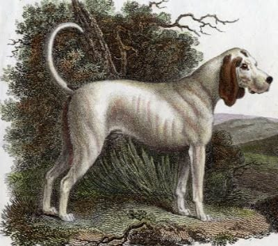

[](https://github.com/front-matter/talbot/actions/workflows/build.yml)
[](https://badge.fury.io/py/talbot)
[](https://sonarcloud.io/summary/new_code?id=front-matter_talbot)
[](https://sonarcloud.io/summary/new_code?id=front-matter_talbot)


> The Talbot was a type of hunting hound common in England during the Middle Ages... It is now extinct, but is believed to be an ancestor of the modern Beagle and Bloodhound. - [Wikipedia](https://en.wikipedia.org/wiki/Talbot_(hound))

Talbot is a Python library to convert scholarly metadata, modelled after the [briard ruby gem](https://github.com/front-matter/briard). Talbot is work in progress, the first release on PyPi (version 0.5.0) was on February 16, 2023.

## Installation

Stable version
```
pip (or pip3) install talbot
```

Dev version
```
pip install git+https://github.com/front-matter/talbot.git#egg=talbot
```

## Testing

Talbot uses `pytest` and `vcrpy` for testing. To run the tests, issue one of the following commands from the root folder:

All tests:
```
pytest
```

All tests in a test file, e.g. `tests/test-utils.py`:
```
pytest tests/test-utils.py
```

Run a specific test e.g. `test_datacite_api_url` in `tests/test-utils.py`:
```
pytest tests/test-utils.py -k 'test_datacite_api_url'
```

`vcrpy`records HTTP requests to speed up testing. 
